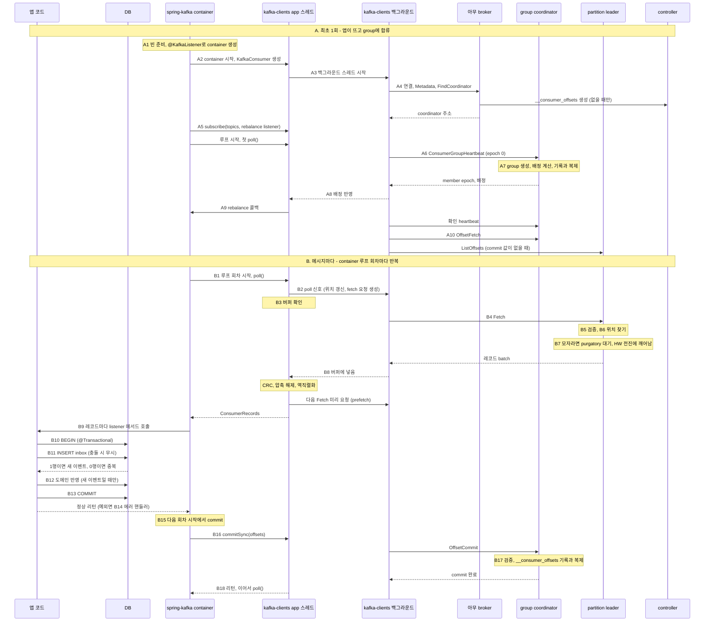

# Inbox 소비의 내부 처리 흐름

`group.protocol=consumer`를 사용하는 Spring Kafka의 합류·fetch·처리·commit 순서를 따라간다. 원문의 설계 표기는 `v1-26.09.26`이다.

관련 문서: [Inbox 구현](inbox.md), [발행 내부 흐름](producer-flow.md).

## 참고사항

- 범위: 앱이 뜰 때 listener container가 KafkaConsumer를 만들고 group에 합류해 읽을 위치를 정하기까지(A), 그리고 container 루프 한 회차에서 레코드를 받아 **@KafkaListener** 메서드가 Inbox로 중복을 거르며 처리하고 offset commit이 확정되기까지(B).
- 가정
  - Spring Boot + spring-kafka(@KafkaListener, 레코드 단위 listener, AckMode BATCH 기본값, DefaultErrorHandler에 DLT recoverer를 붙임), 그 아래 Java kafka-clients.
  - `group.protocol=consumer`(`spring.kafka.consumer.properties.group.protocol`로 켬), `isolation.level` 기본값.
  - **Inbox가 기본**: consumer 쪽 DB에 Inbox 테이블(이벤트 id가 기본 키)을 두고, listener 메서드가 @Transactional로 Inbox 기록과 도메인 반영을 한 트랜잭션에서 함. 모든 이벤트에 고유한 이벤트 id가 있음.
- 코드에서 broker까지의 층
  - broker → kafka-clients(KafkaConsumer) → spring-kafka(listener container) → 앱 코드(@KafkaListener 메서드).
  - container 스레드 하나가 spring-kafka 루프, kafka-clients의 poll()과 commitSync(), 앱의 listener 메서드를 모두 차례로 실행함. 네트워크는 kafka-clients 백그라운드 스레드만 함.
  - 앱 코드는 poll()과 commit을 직접 부르지 않음. container가 대신 부름.
- 등장 주체: 앱 코드(listener 메서드), DB(Inbox와 도메인 테이블), spring-kafka(listener container), kafka-clients(container 스레드에서 도는 app 스레드 쪽 + 백그라운드 스레드), 아무 broker, group coordinator broker, partition leader broker, controller.
- 읽는 법: 단계 제목의 대괄호가 그 단계를 실행하는 층. A는 앱이 뜰 때 한 번(rebalance 때는 일부가 다시 일어남), B는 container 루프 회차마다 반복됨. 다이어그램의 A6, B11 같은 번호가 아래 단계 번호와 같음.

## A. 최초 1회: 앱이 뜨고 group에 합류

- 1. [Spring Boot · spring-kafka] 앱 시작: 빈 준비와 **@KafkaListener**로 container 생성
  - auto-configuration이 `spring.kafka.consumer.*`로 ConsumerFactory를, `spring.kafka.listener.*`로 container factory(ConcurrentKafkaListenerContainerFactory)를 만듦.
    - 전용 속성이 없는 설정(예: `group.protocol`)은 `spring.kafka.consumer.properties.*`로 그대로 전달됨.
    - deserializer 기본값은 key, value 모두 문자열용(StringDeserializer). 역직렬화 실패에 대비해 ErrorHandlingDeserializer로 감싸 두는 것이 좋음 (B14).
  - @KafkaListener가 붙은 메서드를 찾아 endpoint로 등록함. 모든 빈이 만들어진 뒤 endpoint마다 container factory로 container(ConcurrentMessageListenerContainer)를 만듦.
  - 이 시점엔 container를 만들기만 하고 시작하지 않음. KafkaConsumer도 아직 없음.
- 2. [spring-kafka → kafka-clients] container 시작: ConsumerFactory로 KafkaConsumer 생성
  - 애플리케이션 컨텍스트가 뜨는 마지막 단계(refresh 끝, 다른 빈보다 늦은 순서)에서 container들이 자동으로 start됨.
  - `concurrency`가 N이면 자식 container N개가 각자 start되고, 각자 ListenerConsumer 하나를 만듦. 생성자에서 차례로:
    1. AckMode와 consumer 설정을 정리함.
    2. `enable.auto.commit`을 직접 설정하지 않았으면 false로 덮어씀. commit은 container가 함 (B15).
    3. ConsumerFactory.createConsumer(...) → new KafkaConsumer(설정). 여기부터 kafka-clients (3번).
    4. subscribe(topics, rebalance listener)를 부름 (5번).
  - 그다음 ListenerConsumer를 executor에 넘겨 container 스레드에서 루프를 시작함 (6번, B1). 시작한 쪽은 container 스레드가 뜰 때까지 잠깐 기다림.
    - 스레드 이름은 '리스너 id-번호-C-n'. virtual thread를 켜 두면 가상 스레드 'kafka-n'.
  - 여기까지는 컨텍스트를 띄우는 스레드에서 실행되고, 이후 KafkaConsumer는 container 스레드만 씀.
- 3. [kafka-clients] **KafkaConsumer** 생성과 백그라운드 스레드 시작
  - ConsumerFactory가 부른 new KafkaConsumer(설정)의 안쪽. `group.protocol=consumer`면 새 구현(AsyncKafkaConsumer)이 선택됨. classic이면 예전 구현이라 스레드 구조가 다름.
  - 생성자가 하는 일
    - deserializer, 설정, 메타데이터 캐시(처음엔 bootstrap 주소만 앎)를 준비함.
    - member id를 UUID로 직접 만듦. consumer가 살아 있는 동안 바뀌지 않음. (classic에서는 broker가 발급)
    - 백그라운드 스레드를 띄움. 이 스레드가 request manager들을 만들고, 생성자는 그 준비가 끝날 때까지 기다림.
  - 두 스레드의 역할
    - app 스레드(poll()을 부르는 스레드, 여기서는 container 스레드): 레코드 파싱과 역직렬화, rebalance 콜백 실행.
    - 백그라운드 스레드: 모든 네트워크 I/O(heartbeat, fetch, commit, 메타데이터).
    - 둘은 이벤트 큐 2개로 대화함. app → 백그라운드는 요청 이벤트, 백그라운드 → app은 에러와 콜백 요청.
  - 이 프로토콜에서는 `session.timeout.ms`, `heartbeat.interval.ms`, `partition.assignment.strategy`를 설정하면 예외가 남. 이 값들은 broker가 정함 (7번).
- 4. [kafka-clients → broker] bootstrap 접속, 메타데이터, coordinator 찾기 (**FindCoordinator**)
  - 백그라운드 스레드가 시작하자마자 bootstrap 주소로 연결 → **ApiVersions** → **MetadataRequest** ([발행 흐름](producer-flow.md)의 A4와 같음).
  - coordinator를 모르는 동안 매 루프 **FindCoordinator**를 가장 한가한 broker에 보냄. key는 group id. subscribe()를 기다리지 않음.
  - broker 내부
    - group id의 해시를 `__consumer_offsets` partition 수로 나눈 나머지 → 그 partition의 leader broker가 이 group의 coordinator.
    - 이 계산은 어느 broker가 해도 같음. broker는 자기 메타데이터 사본에서 그 partition의 leader를 찾아 알려 줌.
    - `__consumer_offsets`가 아직 없으면(클러스터에 group이 처음 생길 때) broker가 controller에 생성을 요청하고, 일단 **COORDINATOR_NOT_AVAILABLE**로 답함 → 라이브러리가 잠시 후 다시 물음.
  - 이후 coordinator가 바뀌면(그 partition의 leader가 바뀌면) 요청이 **NOT_COORDINATOR**로 실패함 → 라이브러리가 coordinator를 모르는 상태로 되돌리고 다시 찾음.
- 5. [spring-kafka → kafka-clients] **subscribe()**: 구독 topic과 rebalance listener 등록
  - container가 @KafkaListener의 topic 목록(또는 정규식)과 함께 spring-kafka의 rebalance listener를 넘김. 앱이 등록한 rebalance listener가 있으면 이 안에서 불러 줌 (9번).
  - 호출한 스레드는 백그라운드가 구독 정보를 반영할 때까지 잠깐 기다리지만, 반영 내용은 '구독이 바뀌었다'는 표시 하나뿐. 네트워크를 타지 않음.
  - 실제 group 합류는 6번, container 루프의 첫 poll()에서 시작됨. subscribe()만 하고 poll()을 부르지 않으면 group에 들어가지 않음.
- 6. [kafka-clients → coordinator] container 루프의 첫 **poll()**에서 group 합류: **ConsumerGroupHeartbeat**
  - container 스레드의 루프(B1)가 처음 poll()을 부르는 순간이 이 단계. 앱 코드는 poll()을 직접 부르지 않음.
  - 첫 poll()이 백그라운드에 신호를 보내면, 멤버 상태가 '구독 안 함'에서 '합류 중'으로 바뀌고 heartbeat를 바로 보냄.
  - 이 프로토콜에서는 합류, 배정 받기, 생존 신호, 탈퇴가 전부 이 요청 하나로 이루어짐. classic의 JoinGroup, SyncGroup, Heartbeat, LeaveGroup을 대체함.
  - 첫 heartbeat에 담는 것
    - group id, member id(3번에서 만든 UUID), member epoch 0('새로 들어왔다'는 뜻).
    - 구독 topic 이름.
    - rebalance timeout: 값은 `max.poll.interval.ms`. partition을 내려놓으라는 요청을 받았을 때 이 시간 안에 처리하겠다는 약속.
    - 지금 가진 partition: 합류할 때는 반드시 빈 목록.
    - 서버 assignor 이름: `group.remote.assignor`를 지정했을 때만.
  - 두 번째 heartbeat부터는 바뀐 항목만 보냄.
  - 배정과 시작 위치가 준비될 때까지(7번부터 10번까지) 처음 몇 번의 poll()은 빈 결과를 돌려줌.
- 7. [coordinator broker] group과 멤버 생성, partition 배정 계산
  - 수신 경로는 다른 요청과 같음. coordinator 안에서는 `__consumer_offsets` partition 하나가 상태 기계 하나라, 같은 partition에 모인 group들의 요청은 순서대로 처리됨 ([Consumer Group](kafka-clients.md)).
  - 처리 순서
    1. member epoch가 0이고 group이 없으면 새로 만들고 멤버를 추가함.
    2. 구독 정보가 바뀌었으므로 group epoch를 올림. group epoch는 '배정을 다시 계산해야 하는 변화'의 세대 번호.
    3. 목표 배정 계산: 서버 쪽 assignor(`group.consumer.assignors`, 기본 uniform)가 모든 멤버와 partition을 보고 누가 무엇을 가질지 정함.
    4. 멤버별 조정: 각 멤버를 목표 배정 쪽으로 옮김. 다른 멤버가 아직 들고 있는 partition은 그 멤버가 내려놓기 전까지 넘겨주지 않음 → 한 partition을 두 멤버가 동시에 읽는 일이 없음.
    5. 멤버 정보, group epoch, 목표 배정, 현재 배정을 레코드로 `__consumer_offsets`의 그 partition에 씀.
    6. 메모리 상태에는 바로 반영하지만, 응답은 이 레코드가 복제로 확정(high watermark 통과)될 때까지 보류함. coordinator가 바뀌어도 새 leader가 이 로그로 상태를 복원할 수 있어야 하기 때문.
  - 응답에 담는 것: member epoch, 배정된 partition(topic 이름이 아니라 topic id로), 다음 heartbeat까지의 간격(`group.consumer.heartbeat.interval.ms`, 기본 5초).
  - 생존 감시도 broker가 함: `group.consumer.session.timeout.ms`(기본 45초) 동안 heartbeat가 없으면 멤버를 빼고 그 partition을 다른 멤버에게 재배정함.
  - classic과의 차이: 배정을 client 쪽 group leader가 아니라 coordinator가 직접 계산하고, 바뀌는 partition만 옮김. 다른 멤버는 멈추지 않음.
- 8. [kafka-clients] 배정 반영 (reconciliation)
  - 백그라운드가 응답의 topic id를 메타데이터로 topic 이름으로 바꿈. 모르는 id면 메타데이터를 새로 받아 옴.
  - 반영 순서
    1. 내려놓을 partition부터: 그 partition의 fetch를 멈추고, auto commit이 켜져 있으면 여기서 commit함.
    2. 회수 콜백(**onPartitionsRevoked**)을 실행함. 이 콜백은 5번에서 넘긴 spring-kafka의 rebalance listener (9번).
    3. 새 partition을 할당하고 할당 콜백(**onPartitionsAssigned**)을 실행함 (역시 9번).
    - 콜백은 백그라운드가 아니라 app 스레드(container 스레드)가 poll() 안에서 실행함. 백그라운드가 '콜백 필요' 이벤트를 보내면 app 스레드가 poll()에서 처리함.
    - 그래서 poll()을 부르지 않으면 rebalance가 끝나지 않음.
  - 다 반영하면 확인 상태로 바꾸고 바로 heartbeat를 보내 지금 가진 partition을 알림 → coordinator가 이를 보고 조정을 마무리함 → 안정 상태.
  - 멤버 상태 흐름: UNSUBSCRIBED → JOINING → RECONCILING → ACKNOWLEDGING → STABLE. 이후 배정이 바뀌면 RECONCILING으로 돌아감.
  - 이후 heartbeat는 응답이 알려 준 간격마다 백그라운드가 보냄. 응답에 새 배정이 오면 이 8번과 9번이 다시 일어남 (= rebalance).
- 9. [spring-kafka] rebalance 콜백 처리
  - 8번에서 kafka-clients가 부르는 콜백은 5번에서 넘긴 spring-kafka의 rebalance listener. container 스레드가 poll() 안에서 실행함.
  - partition을 내려놓을 때 (revoked)
    1. 앱이 등록한 listener의 'commit 전' 콜백을 부름.
    2. 그때까지 처리했지만 아직 commit하지 않은 offset(B9에서 모아 둔 것)을 **먼저 commit**함. 넘어가는 partition을 새 담당자가 중복 없이 이어받게 하려는 것.
    3. 앱 listener의 'commit 후' 콜백을 부름.
  - partition을 받을 때 (assigned)
    1. listener가 ConsumerSeekAware를 구현했다면 초기 위치를 지정(seek)할 기회를 먼저 줌.
    2. 앱이 등록한 rebalance listener의 onPartitionsAssigned를 부름.
    3. 에러 핸들러에도 새 배정을 알림.
  - 앱이 listener를 등록하지 않으면 로그만 남기는 기본 listener가 쓰임.
  - KIP-848에서는 배정이 조금씩 바뀌므로 이 콜백이 작은 partition 묶음으로 여러 번 불릴 수 있음.
- 10. [kafka-clients → broker] 읽기 시작할 위치 정하기 (**OffsetFetch**, **ListOffsets**) - poll()의 신호를 받으면 백그라운드가 새로 받은 partition의 위치를 채움. - 순서 1. **OffsetFetch**를 coordinator에 보내 이 group이 commit해 둔 offset을 받음. coordinator는 메모리에 올려 둔 값으로 바로 답함. 2. commit 값이 있으면 그 위치부터 읽음. commit 값은 '마지막으로 처리한 offset'이 아니라 '다음에 읽을 offset'. 3. 없으면 `auto.offset.reset`을 따름: **ListOffsets**를 partition leader에 보내 가장 오래된 위치(earliest) 또는 끝 위치(latest, 기본값)를 받음. 새 group이 latest면 그 전에 쌓인 메시지는 읽지 않음. 4. leader가 바뀐 뒤처럼 필요할 때는 **OffsetsForLeaderEpoch**로 그 위치가 새 leader의 log에서도 유효한지 확인함 (KIP-320). log가 잘려 나간 경우를 잡아냄. - 위치가 정해지면 그 partition은 fetch 대상이 됨 → B로.

## B. 메시지마다: container 루프 1회차

- 1. [spring-kafka · container 스레드] 루프 회차 시작 → **poll()** 호출
  - container 스레드는 멈출 때까지 같은 순서를 반복함 (ListenerConsumer 루프 한 바퀴):
    1. 앞 회차에서 처리가 끝난 offset이 있으면 먼저 commit함. 15번과 16번이 실제로 일어나는 자리.
    2. 필요하면 poll 사이에 쉬고, 요청된 seek를 반영하고, pause 요청이 있으면 consumer를 멈춤.
    3. consumer.poll(poll timeout)을 부름. `spring.kafka.listener.poll-timeout`, 기본 5초. 여기서 kafka-clients로 넘어감 (2번).
    4. 받은 레코드가 있으면 listener를 부름 (9번).
    5. resume 요청이 있으면 다시 풀어 줌.
  - 앱 코드는 이 루프를 직접 짜지 않음. listener 메서드만 제공함.
- 2. [kafka-clients · app 스레드] **poll()** 호출
  - container가 부른 poll(timeout). timeout은 container의 poll timeout(1번)이고, '레코드가 없을 때 최대로 기다릴 시간'이지 주기가 아님.
  - poll()이 하는 일 (app 스레드 = container 스레드)
    1. poll 타이머를 리셋함. `max.poll.interval.ms`(기본 5분) 안에 다음 poll()이 와야 '처리 루프가 살아 있다'로 인정됨.
    2. 백그라운드에 '지금 poll 중' 신호를 하나 보냄. 결과를 기다리지 않음. 이 신호를 받은 백그라운드는 위치를 갱신하고(A10) fetch 요청을 만듦(4번). auto commit을 켰다면 주기가 지났는지도 이때만 검사함.
    3. 백그라운드가 보낸 이벤트를 처리함: 에러 전달, rebalance 콜백 실행(A8, A9).
  - 그동안 백그라운드는 heartbeat를 따로 계속 보냄. heartbeat는 '프로세스가 살아 있다', poll 간격은 '처리 루프가 돈다'를 증명하는 별개의 신호.
  - 실패하면: poll 간격이 `max.poll.interval.ms`를 넘으면 백그라운드가 먼저 group을 떠남(탈퇴 heartbeat, epoch -1). 가진 partition을 잃고 유실 콜백(**onPartitionsLost**)이 불림. 다음 poll()에서 다시 합류함(A6부터).
- 3. [kafka-clients · app 스레드] 버퍼 확인
  - 전에 받아 둔 응답이 버퍼에 있으면 네트워크 없이 바로 8번으로 감.
  - 없으면 레코드가 도착하거나 poll timeout이 될 때까지 기다림.
  - Java의 새 consumer는 백그라운드가 혼자 계속 fetch하지 않음. fetch 요청은 poll()의 신호(2번)와, 레코드를 돌려주기 직전의 미리 요청(8번)으로만 만들어짐. 그래서 앱이 처리하는 동안 미리 받아 두는 양은 대략 fetch 한 번 분량.
- 4. [kafka-clients · 백그라운드] **Fetch** 전송
  - fetch 대상 partition: 버퍼에 데이터가 없고, pause나 회수 대기 중이 아니고, 읽을 위치가 정해진 partition.
  - broker 단위로 묶음: partition leader(또는 지정된 read replica)별로 **Fetch** 요청 하나. 이미 응답을 기다리는 fetch가 있거나 버퍼에 그 broker의 데이터가 남아 있으면 그 broker는 이번에 건너뜀.
  - 요청에 싣는 것
    - partition별 읽을 위치와 알고 있는 leader epoch.
    - 대기 조건: `fetch.min.bytes`(기본 1), `fetch.max.wait.ms`(기본 500ms).
    - 양의 상한: `max.partition.fetch.bytes`(기본 1MB), `fetch.max.bytes`(기본 50MB).
    - `isolation.level`.
  - fetch session (KIP-227): broker별로 세션을 두고, 두 번째 요청부터는 바뀐 partition만 보냄. partition이 많을 때 요청 크기를 줄임.
- 5. [leader broker] 요청 수신과 검증
  - network thread → request queue → I/O thread ([발행 흐름](producer-flow.md)의 B7과 같은 경로).
  - partition마다 검증
    - 이 broker가 leader인가 → 아니면 **NOT_LEADER_OR_FOLLOWER**. 새 leader 정보를 실어 줌.
    - 요청의 leader epoch가 현재와 맞는가 → 옛 epoch면 **FENCED_LEADER_EPOCH**. 라이브러리가 메타데이터를 갱신하고 위치를 검증함(A10의 4).
    - 읽을 위치가 log 범위 안인가 → 아니면 **OFFSET_OUT_OF_RANGE**. 라이브러리가 `auto.offset.reset`으로 위치를 다시 정함. 보존 기간이 지나 지워진 구간이면 그 사이 메시지는 유실.
- 6. [leader broker] 읽을 범위와 위치 찾기
  - 어디까지 읽을 수 있나
    - consumer(read_uncommitted, 기본값): high watermark까지. 확정된 메시지만.
    - read_committed: LSO(아직 끝나지 않은 가장 오래된 트랜잭션의 시작)까지.
    - follower: LEO까지. 복제하려면 확정 전 데이터도 가져가야 하기 때문.
  - 위치 찾기: 읽을 위치가 든 segment를 시작 offset으로 이진 탐색 → 그 segment의 희소 색인에서 가장 가까운 앞 항목을 이진 탐색 → 그 파일 위치부터 앞으로 스캔.
  - batch 단위로 잘라 줌: 읽을 위치가 든 batch의 시작부터 보내므로, 앞부분의 이미 읽은 레코드는 라이브러리가 버림.
  - 데이터를 복사하지 않고 '파일의 이 구간'만 가리켜 둠. 응답을 보낼 때 page cache에서 소켓으로 바로 보냄(zero-copy). TLS를 켜면 암호화 때문에 이게 안 됨 ([브로커](kafka-cluster.md)).
  - 방금 쓰인 데이터는 page cache에 있어 디스크를 읽지 않음. 오래된 데이터를 다시 읽는 consumer는 디스크를 읽음.
- 7. [leader broker] 모자라면 purgatory에서 대기
  - 모은 바이트가 `fetch.min.bytes`보다 적으면 바로 응답하지 않고 **DelayedFetch**를 fetch purgatory에 넣음. I/O thread는 반납됨.
  - 깨어나는 때: 요청한 partition에 읽을 수 있는 데이터가 생겼을 때, 또는 `fetch.max.wait.ms`가 지났을 때.
  - consumer의 Fetch를 깨우는 건 leader의 append가 아니라 **high watermark 전진**([발행 흐름](producer-flow.md)의 B11). consumer는 확정된 메시지만 읽기 때문.
    - 그래서 produce부터 consume까지의 지연은 대략 follower 복제 시간 + fetch 왕복.
  - 이 대기 덕분에 poll을 계속 돌아도 바쁜 대기가 되지 않음 (long polling, [Consumer](kafka-clients.md)).
- 8. [kafka-clients] 응답을 버퍼에 넣고, **poll()**이 레코드를 꺼내 돌려줌
  - 백그라운드는 응답을 받아 partition별로 버퍼에 넣기만 함. 파싱은 하지 않음.
  - app 스레드가 poll() 안에서 버퍼를 꺼내 처리함
    1. batch마다 CRC 검사(`check.crcs`).
    2. 압축 해제.
    3. key와 value 역직렬화.
    4. 읽을 위치보다 앞의 레코드는 버리고, 최대 `max.poll.records`(기본 500)개까지 모음.
    - 압축 해제와 역직렬화가 app 스레드에서 일어나므로, 이 비용은 poll() 시간에 들어감.
  - 돌려주기 직전에 다음 Fetch를 미리 요청함(prefetch). listener가 9번부터 13번까지를 처리하는 동안 다음 데이터가 도착해 버퍼에 쌓임.
  - 레코드가 있으면 poll()이 ConsumerRecords를 container에 리턴함 (9번). 각 partition의 읽을 위치는 돌려준 마지막 offset + 1로 전진함.
- 9. [spring-kafka] 레코드를 메서드 인자로 바꿔 **@KafkaListener** 메서드 호출
  - poll()이 돌려준 ConsumerRecords를 레코드마다 차례로 처리함 (레코드 단위 listener).
    1. 역직렬화 실패 확인: ErrorHandlingDeserializer로 감싸 두었다면 실패가 여기서 드러나 바로 14번으로 감.
    2. record interceptor를 등록했다면 먼저 거침.
    3. 메시지 변환: ConsumerRecord를 Spring Message로 바꿈. payload는 kafka-clients deserializer가 이미 만든 value, 헤더에는 key, topic, partition, offset 등이 들어감. 문자열 value를 DTO로 받으려면 JSON용 message converter가 필요함.
    4. 메서드 파라미터(@Payload, @Header 등)에 맞춰 인자를 만들고 listener 메서드를 부름 → 10번부터 13번.
    5. 메서드가 정상 리턴하면 그 레코드를 'commit 대기' 큐에 넣음. AckMode BATCH는 여기서 commit하지 않음 (15번).
  - 예외를 던지면 14번으로.
  - 순서: 레코드는 한 container 스레드에서 차례로 처리되므로 partition 안의 순서가 지켜짐. listener 안에서 다른 스레드로 넘기면 순서도 commit 시점도 깨짐.
  - 처리 시간 주의: 한 번 poll한 묶음을 다 처리하는 시간이 `max.poll.interval.ms`를 넘으면 2번의 이탈이 일어남. 오래 걸리는 처리는 `max.poll.records`를 줄이거나 pause와 별도 작업자로 풀어야 함 ([Inbox 구현](inbox.md)).
- 10. [앱 · Spring] **@Transactional**로 DB 트랜잭션 시작
  - 레코드마다 DB 트랜잭션을 시작한다. listener 또는 listener가 호출하는 처리 서비스의 트랜잭션 경계 안에 Inbox와 도메인 변경을 함께 둔다. 구현 예시는 [Listener와 처리 서비스](inbox.md#3-listener와-처리-서비스)를 따른다.
- 11. [앱 · DB] Inbox에 이벤트 id 기록 시도: 중복 판정
  - Inbox INSERT 성공이면 도메인 처리로, 중복이면 정상 반환으로 진행한다. 동시 중복·재발행을 막는 방식은 [처리 서비스](inbox.md#3-listener와-처리-서비스), 보관 기간은 [Inbox 테이블](inbox.md#2-inbox-테이블)을 따른다.
- 12. [앱 · DB] 도메인 반영 (새 이벤트일 때만)
  - 새 이벤트의 도메인 상태를 갱신하고 실패하면 Inbox 기록까지 롤백한다. 서로 다른 이벤트의 순서 역전은 [버전 비교](inbox.md#3-listener와-처리-서비스)로 처리한다.
- 13. [앱 · Spring] 메서드 리턴 → COMMIT: Inbox 행과 도메인 변경이 함께 확정
  - DB commit이 끝난 뒤 container로 돌아와 offset commit 대기에 들어간다(B9·B15). DB commit 실패도 B14의 오류 처리로 전달한다.
- 14. [spring-kafka] 처리 실패: 에러 핸들러와 DLT
  - 실패한 레코드는 seek·재시도 후 recoverer로 전달한다. [재시도와 DLQ](inbox.md#4-에러-처리-재시도와-dlq)의 설정과 [처리 시간 예산](inbox.md#5-처리-시간-예산)을 따른다. DLQ로 간 레코드는 Inbox에 기록되지 않아 재투입 시 처음 처리로 들어온다. recoverer 성공 뒤 offset commit은 B15에서 진행한다.
- 15. [spring-kafka] 다음 회차 시작에서 commit할 offset 정리
  - AckMode BATCH에서는 9번에서 'commit 대기' 큐에 넣어 둔 레코드를 다음 루프 바퀴의 시작(1번의 1)에서 처리함.
    1. 큐에서 레코드를 꺼내 partition별로 가장 큰 offset만 남김.
    2. 각각 offset + 1(다음에 읽을 위치)로 commit할 목록을 만듦.
    3. consumer.commitSync(목록, 대기 시간)을 부름 → 16번. 기본이 동기 commit이라 container 스레드가 결과를 기다림.
  - 그래서 이번 회차 레코드의 commit은 실제로는 다음 poll 직전에 일어남.
  - partition을 빼앗길 때는 다음 회차를 기다리지 않고 rebalance 콜백 안에서 바로 commit함 (A9).
  - 다른 AckMode: RECORD는 레코드마다 바로, TIME과 COUNT는 시간이나 개수가 차면, MANUAL 계열은 listener가 Acknowledgment.acknowledge()를 부른 것만.
- 16. [kafka-clients · app 스레드] **commitSync()**: OffsetCommit 요청과 대기
  - 넘기는 값: container가 정리한 partition별 '처리한 마지막 offset + 1'(다음에 읽을 위치) (15번).
  - app 스레드(container 스레드)는 결과를 기다림. 최대 `default.api.timeout.ms`(기본 60초). container가 대기 시간을 따로 정하지 않으면 이 값을 씀.
  - 백그라운드가 **OffsetCommit**을 coordinator에 보냄. group id, member id, member epoch를 함께 실음.
  - AckMode BATCH라 poll 한 번에 받은 묶음마다 한 번 commit함. 대신 죽으면 그 묶음을 다시 받음(Inbox가 흡수).
  - 실패하면
    - coordinator가 옮겨 갔거나(**NOT_COORDINATOR**) 응답이 늦으면: coordinator를 다시 찾아 timeout 안에서 재시도함.
    - **UNKNOWN_MEMBER_ID**, **STALE_MEMBER_EPOCH**: 재시도하지 않고 **CommitFailedException**. 이미 group에서 빠졌거나 partition이 다른 멤버로 넘어간 상태. 이 레코드들은 새 담당자가 다시 받지만 Inbox가 거름.
- 17. [coordinator broker] **OffsetCommit** 처리
  - 검증
    - 모르는 멤버 → **UNKNOWN_MEMBER_ID**.
    - member epoch가 현재보다 큼 → **STALE_MEMBER_EPOCH**.
    - member epoch가 현재보다 작음: 그 partition을 아직 배정이나 회수 대기로 들고 있고, 그 partition을 받은 시점의 epoch 이상이면 허용함. rebalance 중에도 내려놓기 전 마지막 commit을 할 수 있게 하려는 것. 아니면 **STALE_MEMBER_EPOCH**.
    - 이 검증이 '이미 다른 멤버에게 넘어간 partition의 offset을 옛 멤버가 덮어쓰는 일'을 막음.
  - 기록: OffsetCommit 레코드(key: group, topic, partition → offset)를 `__consumer_offsets`의 그 group partition에 씀.
  - 메모리의 offset 표에는 바로 반영하지만, 응답은 레코드가 복제로 확정(high watermark 통과)될 때까지 보류함. Producer의 `acks=all`과 같은 원리.
  - `__consumer_offsets`는 compact topic이라 key별 최신 값만 남음. commit을 계속해도 로그가 끝없이 커지지 않음.
  - controller: `__consumer_offsets` partition의 leader를 정하는 건 controller. coordinator broker가 죽으면 controller가 ISR 중에서 새 leader를 뽑고, 새 leader가 로그를 읽어 group 상태를 복원함. 그동안 요청은 **NOT_COORDINATOR**로 실패하고 라이브러리가 다시 찾음(A4).
- 18. [kafka-clients → spring-kafka] commit 완료 → 회차 종료 - 응답을 받으면 commitSync()가 리턴하고, container는 같은 루프 바퀴에서 이어서 poll()을 부름 (1번의 3). 8번에서 미리 요청한 데이터가 이미 버퍼에 있으면 네트워크 대기 없이 바로 레코드가 나옴. - 중간에 죽으면 - DB COMMIT 전에 죽음: 트랜잭션이 롤백되어 Inbox 행도 없음 → 다시 받아 처음부터 처리함. - DB COMMIT 후, offset commit 전에 죽음: 그 poll 묶음을 다시 받음(BATCH라 다음 회차 시작 전까지가 이 구간) → 11번 INSERT가 0행 → 도메인 반영 없이 넘어감. - offset commit까지 끝난 뒤 죽음: 다음 레코드부터 받음. - 어느 경우든 유실은 없고 중복만 생김. Kafka 전달은 at-least-once이지만, Inbox 덕분에 도메인 반영은 한 번만 일어남. - 유실이 생기는 경우: 에러 핸들러에 recoverer를 붙이지 않아 실패 레코드를 건너뛸 때 (14번). 또는 commit 위치의 메시지가 보존 기간(`retention.ms`)으로 지워졌거나, 멤버 없는 group의 commit 값이 `offsets.retention.minutes`(기본 7일)로 만료된 경우 → `auto.offset.reset`이 적용되어 사이 구간을 건너뜀.
