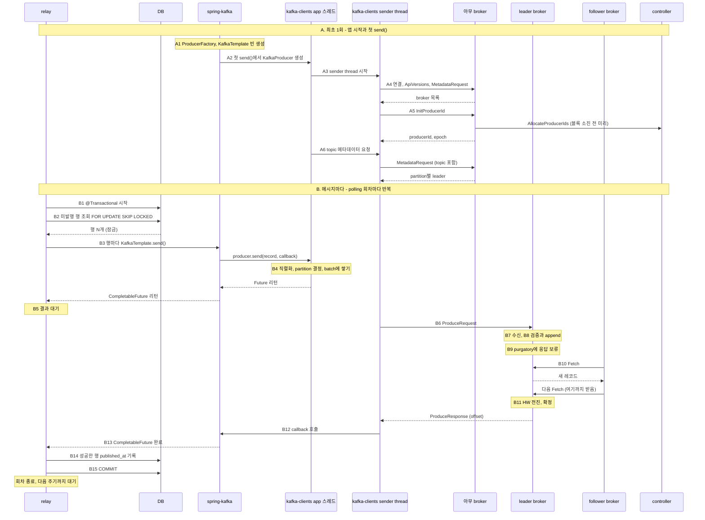

# Outbox 발행의 내부 처리 흐름

relay부터 Spring Kafka·Java 클라이언트·브로커 복제·ack까지 실행 순서를 따라간다. 원문의 설계 표기는 `v1-26.09.26`이다.

관련 문서: [Outbox 구현](outbox.md), [소비 내부 흐름](consumer-flow.md).

## 참고사항

- 범위: relay의 **@Scheduled** 메서드가 outbox를 polling하는 순간부터, KafkaTemplate과 kafka-clients를 거쳐 보낸 메시지가 확정(ack)되고 **published_at**을 기록한 뒤 DB commit으로 그 회차를 끝내기까지.
- 가정: Spring Boot + spring-kafka(KafkaTemplate), 그 아래 Java kafka-clients. `acks=all`, `enable.idempotence=true`(kafka-clients 기본값), Kafka transaction은 쓰지 않음(`spring.kafka.producer.transaction-id-prefix` 없음). partition마다 replica 3개(leader 1 + follower 2), `min.insync.replicas` 2, 모든 메시지에 key가 있음. DB는 JDBC와 @Transactional.
- 코드에서 broker까지의 층
  - 앱 코드(relay) → spring-kafka(KafkaTemplate, ProducerFactory) → kafka-clients(KafkaProducer) → broker.
  - relay 코드, KafkaTemplate, kafka-clients의 send()는 모두 relay 스레드 하나에서 차례로 실행됨. 네트워크는 kafka-clients의 sender thread만 함.
- 등장 주체: relay(애플리케이션 안의 스케줄러 작업), DB(outbox 테이블), spring-kafka, kafka-clients(**send()**가 도는 app 스레드 쪽 + 백그라운드 sender thread), leader broker, follower broker, controller.
- 읽는 법: 단계 제목의 대괄호가 그 단계를 실행하는 층. [spring-kafka] 다음에 [kafka-clients]가 오면 그 사이가 spring-kafka가 kafka-clients를 부르는 지점. A는 앱 시작과 첫 send() 때 한 번, B는 polling 회차마다 반복됨. 다이어그램의 A2, B5 같은 번호가 아래 단계 번호와 같음.

## A. 최초 1회: 앱 시작과 첫 send() 때 준비

- 1. [Spring Boot] 앱 시작: ProducerFactory와 KafkaTemplate 빈 준비
  - KafkaAutoConfiguration이 `spring.kafka.*` 속성을 모아 ProducerFactory(DefaultKafkaProducerFactory)와 KafkaTemplate 빈을 만듦. 실패를 로그로 남기는 LoggingProducerListener도 붙음.
  - 속성은 kafka-clients 설정으로 옮겨짐
    - 예: `spring.kafka.bootstrap-servers` → `bootstrap.servers`, `spring.kafka.producer.acks` → `acks`.
    - 전용 속성이 없는 설정은 `spring.kafka.producer.properties.*`에 적으면 그대로 전달됨. producer와 consumer 공통 설정은 `spring.kafka.properties.*`.
  - serializer 기본값은 key, value 모두 문자열용(StringSerializer). 객체를 보내려면 value serializer를 JSON용(JacksonJsonSerializer)으로 바꾸거나, relay가 JSON 문자열로 만들어 넘김.
  - 이 시점엔 KafkaProducer가 아직 없음. 연결도 sender thread도 없음 (2번).
  - relay 쪽: @EnableScheduling이 있으면 @Scheduled 메서드를 실행할 스케줄러도 이때 준비됨. virtual thread를 켜 두면 가상 스레드용 스케줄러가 만들어짐.
- 2. [spring-kafka → kafka-clients] 첫 **KafkaTemplate.send()**에서 KafkaProducer 생성
  - relay가 처음 KafkaTemplate.send()를 부르면(B3), KafkaTemplate이 ProducerFactory에 producer를 달라고 함.
  - ProducerFactory는 아직 없으면 그 자리에서 new KafkaProducer(설정)를 부름. 여러 스레드가 동시에 와도 하나만 만들도록 lock을 잡음. 여기부터 kafka-clients (3번).
  - 만든 producer는 CloseSafeProducer로 감싸 모든 스레드가 공유함.
    - KafkaTemplate은 전송이 끝날 때마다 close()를 부르지만, 공유 producer는 실제로 닫히지 않음. 이 producer를 더 쓸 수 없는 에러(OutOfOrderSequenceException 등)가 난 경우에만 실제로 닫힘.
  - 그래서 3번부터 6번까지가 모두 첫 KafkaTemplate.send() 한 번 안에서 일어남.
- 3. [kafka-clients] **KafkaProducer** 생성과 sender thread 시작
  - ProducerFactory가 부른 new KafkaProducer(설정)의 안쪽. 이 producer 하나를 모든 스레드가 계속 재사용함.
  - 생성자에서 조립하는 부품
    - serializer: key와 value를 bytes로 바꾸는 변환기.
    - partitioner: 레코드를 보낼 partition을 정하는 규칙.
    - accumulator: partition별 batch 대기열. batch 메모리는 `buffer.memory`(기본 32MB) 크기의 풀에서 빌림.
    - 메타데이터 캐시: 처음엔 bootstrap 주소만 알고, '갱신 필요' 표시가 켜진 상태.
    - idempotence 관리자: producerId, epoch, partition별 sequence 번호를 관리.
  - 마지막으로 백그라운드 **sender thread**를 띄움. 이후 네트워크 I/O는 전부 이 스레드 하나가 함.
    - 소켓 여러 개를 selector 하나로 감시하는 이벤트 루프 구조 ([네트워크](network.md)).
  - 생성자는 연결을 열지 않음. 연결은 sender thread가 첫 루프에서 시작함 (4, 5번).
- 4. [kafka-clients → broker] bootstrap 접속과 클러스터 메타데이터
  - sender thread가 첫 루프에서 '갱신 필요' 표시를 보고, bootstrap 주소 중 하나로 TCP 연결을 시작함.
  - 연결되면 먼저 **ApiVersions**를 주고받음.
    - broker가 요청 종류별로 지원하는 버전 범위를 알려 주고, 라이브러리는 양쪽이 모두 아는 가장 높은 버전을 씀.
    - broker와 새로 연결할 때마다 한 번씩 함.
  - 그다음 **MetadataRequest**를 보냄. 아직 보낼 topic을 모르므로 topic 목록이 비어 있고, 응답에는 broker 목록(id, 주소)만 담김.
  - broker 내부
    - 이 요청도 다른 요청처럼 network thread → request queue → I/O thread를 거침 (B7과 같은 경로).
    - I/O thread는 자기 메모리의 메타데이터 캐시로 바로 답함. controller에 묻지 않음.
    - 이 캐시는 controller가 메타데이터 로그에 기록한 내용을 broker가 복제해 둔 사본 ([KRaft controller](kafka-cluster.md#controller-kraft)). 그래서 어느 broker에 물어도 같은 답이 나옴.
  - bootstrap 주소는 이 첫 접속에만 쓰임. 이후에는 응답에 담긴 broker별 주소로 직접 연결함.
- 5. [kafka-clients → broker → controller] producerId 발급 (**InitProducerId**)
  - idempotence가 켜져 있으면 sender thread가 시작하자마자 producerId부터 요청함. 4번과 거의 동시에 진행됨.
  - 보내는 곳: 지금 가장 한가한 broker 아무 데나. transaction을 쓰지 않으면 특정 coordinator를 찾을 필요가 없음.
  - broker 내부
    - transaction coordinator 모듈이 받지만, `transactional.id`가 없으므로 트랜잭션 로그에 아무것도 쓰지 않고 producerId 하나와 epoch 0을 돌려줌.
    - producerId는 broker가 controller에게 미리 받아 둔 블록(1000개 단위)에서 하나씩 꺼내 줌.
    - 블록을 90% 쓰면 다음 블록을 controller에 **AllocateProducerIds**로 미리 요청함. controller는 발급 기록을 메타데이터 로그에 남겨, 재시작 후에도 같은 id를 두 번 주지 않음.
    - broker가 막 떠서 첫 블록을 아직 못 받았으면 '잠시 후 재시도' 에러로 답하고, 라이브러리가 다시 보냄.
  - producerId를 받기 전에는 sender thread가 accumulator에서 batch를 꺼내지 않음. 모든 batch에 producerId, epoch, sequence가 붙어야 하기 때문.
  - 한계: 프로세스가 재시작하면 새 producerId를 받음. 그래서 재시작 전후의 중복은 broker가 구분하지 못함 ([Producer](kafka-clients.md) idempotent producer).
- 6. [kafka-clients] 첫 **send()** 때 topic 메타데이터 받기 - 처음 보내는 topic이면 send() 안(relay 스레드)에서 그 topic을 메타데이터 요청 목록에 추가하고 sender thread를 깨움. - sender thread가 topic을 담은 **MetadataRequest**를 보내고, partition 수와 partition별 leader(주소, leader epoch)를 받아 캐시에 넣음. - 그동안 send()는 블록됨. 최대 `max.block.ms`(기본 60초) 기다리고, 넘으면 예외. - 실제로는 B의 첫 회차 4번 안에서 일어남. 2번부터 이 6번까지가 모두 첫 KafkaTemplate.send() 한 번 안에서 일어나므로 첫 회차만 조금 느림. - 이후에는 캐시에서 바로 꺼내 씀. 캐시를 갱신하는 때 - 주기적으로: `metadata.max.age.ms`(기본 5분). - 에러 응답을 받았을 때 즉시 (B12). - 아는 broker가 전부 연결 불가일 때: bootstrap 주소로 다시 시작 (`metadata.recovery.strategy`, 4.x 기본값 rebootstrap).

## B. 메시지마다: polling 1회차

- 1. [relay · Spring] **@Scheduled** 메서드 시작, **@Transactional**로 DB 트랜잭션 시작
  - relay는 애플리케이션 안의 스케줄러 작업. @Scheduled(fixedDelay)로 정해진 주기(예: 1초)마다 한 회차씩 돎.
    - virtual thread를 켜 두면 Spring Boot가 가상 스레드용 스케줄러를 써서, 회차마다 새 가상 스레드에서 돎.
  - @Transactional: Spring이 만든 프록시가 메서드 앞에서 트랜잭션 매니저를 부름 → Hikari 풀에서 DB 커넥션을 빌려 autocommit을 끄고 이 스레드에 묶어 둠 → 이 메서드 안의 JDBC 호출은 모두 이 커넥션, 즉 같은 트랜잭션을 씀.
  - 이 트랜잭션은 도메인 트랜잭션(데이터 변경 + outbox 행 INSERT)과 별개. 도메인 쪽은 이미 커밋됐고, relay는 커밋된 outbox 행만 봄.
  - 발행을 도메인 트랜잭션 안에서 하지 않는 이유: Kafka 전송은 DB 롤백으로 되돌릴 수 없음. 도메인 트랜잭션이 롤백돼도 메시지는 이미 나가 버림.
- 2. [relay · DB] 미발행 행을 조회하고 잠금
  - 조회: JDBC로 **published_at**이 비어 있는 행을 생성 순서대로 N개(예: 100). 끝에 **FOR UPDATE SKIP LOCKED**를 붙임.
  - DB 내부
    - FOR UPDATE: 읽은 행에 행 잠금을 걺. 이 트랜잭션이 끝날 때까지 다른 트랜잭션은 이 행을 잠그거나 수정하지 못함.
    - SKIP LOCKED: 이미 잠긴 행은 기다리지 않고 건너뜀. relay 인스턴스가 여러 개여도 서로 다른 행을 나눠 가져가고, 같은 행을 두 번 보내지 않음.
    - 미발행 행만 담는 부분 인덱스를 두면, 발행된 행이 쌓여도 조회가 느려지지 않음.
  - 커서(마지막으로 본 시각) 대신 플래그(published_at)로 고르는 이유: 먼저 시작했지만 늦게 커밋된 행도 다음 회차에 잡힘. 커서 방식은 이런 행을 영영 건너뜀.
  - 행이 0개면 바로 커밋하고 회차를 끝냄 (15번).
- 3. [relay → spring-kafka] 행마다 **KafkaTemplate.send()**
  - relay 코드는 행마다 kafkaTemplate.send(topic, key, value) 한 줄. 돌려받은 CompletableFuture<SendResult>를 행과 짝지어 모아 둠.
  - spring-kafka 내부 (relay 스레드에서 차례로 실행)
    1. ProducerRecord(topic, key, value)를 만듦. partition과 timestamp는 비워 둠 → kafka-clients가 정함 (4번).
    2. 공유 producer를 꺼냄. 첫 회차라면 여기서 A2부터 A6까지가 일어남.
    3. 전송 시간 측정 타이머를 시작하고, producer interceptor를 등록했다면 먼저 거침. 분산 추적(observation)은 켰을 때만 동작함 (기본 꺼짐).
    4. producer.send(record, callback)을 부름. callback은 KafkaTemplate이 만든 것으로, 결과가 오면 CompletableFuture를 채움 (13번). 여기서 kafka-clients로 넘어감 (4번).
    5. send()가 이미 실패로 끝난 Future를 돌려주면(레코드가 너무 큼 같은 즉시 실패) 그 자리에서 예외를 던짐.
    6. CompletableFuture를 relay에 리턴.
- 4. [kafka-clients · app 스레드] **send()**: batch에 쌓고 바로 리턴
  - KafkaTemplate이 부른 send()도 relay 스레드에서 실행되고, 네트워크를 타지 않음.
  - 순서
    1. 메타데이터 캐시에서 topic 정보 확인. 첫 회차라면 여기서 A6이 일어남.
    2. serializer로 key와 value를 bytes로 바꿈. Spring Boot 기본은 문자열용(StringSerializer) (A1).
    3. partitioner로 partition 결정: key의 murmur2 해시를 partition 수로 나눈 나머지. 같은 key는 항상 같은 partition으로 가서 순서가 유지됨.
    4. 크기 검사: 레코드가 `max.request.size`(기본 1MB)나 `buffer.memory`보다 크면 즉시 예외.
    5. accumulator에 추가: 그 partition의 batch 줄 마지막 batch에 붙임. 없거나 꽉 찼으면 새 batch(`batch.size`, 기본 16KB)를 만듦. 메모리 풀이 가득 차면 `max.block.ms`까지 블록됨.
    6. Future를 리턴. 결과는 나중에 sender thread가 채우고, 그때 KafkaTemplate이 넘긴 callback도 불림 (12, 13번).
  - batch가 꽉 찼거나 새 batch가 생겼으면 sender thread를 깨움 (selector 대기에서 바로 빠져나오게 함).
  - send() 자체는 메모리 작업이라 행이 많아도 금방 끝남. 같은 partition의 레코드는 batch 몇 개에 모임.
- 5. [relay] **CompletableFuture**로 결과를 기다림
  - relay는 행마다 성공 여부를 알아야 **published_at**을 채울 수 있으므로 여기서 멈춤.
  - 기다리는 방법
    - 모아 둔 CompletableFuture를 한꺼번에 기다림 (CompletableFuture.allOf(...).join(), 또는 행마다 get()). 이것만 쓰면 마지막 batch는 `linger.ms`(기본 5ms)만큼 늦게 나감.
    - 먼저 kafkaTemplate.flush()를 부르면 공유 producer의 flush()가 불림. 쌓인 batch를 `linger.ms`를 기다리지 않고 바로 보낼 수 있게 표시하고, 아직 끝나지 않은 batch가 전부 완료될 때까지 블록함.
    - 대기에 상한을 두려면 get(timeout). 시간이 지나 예외가 나도 전송이 취소되지는 않음. kafka-clients는 `delivery.timeout.ms`까지 계속 시도함.
  - 기다리는 동안에도 DB 트랜잭션과 행 잠금은 그대로 유지됨. Kafka 쪽이 느려지면 잠금 시간도 길어짐 (최악은 `delivery.timeout.ms`).
  - 주의: CompletableFuture의 후속 작업(whenComplete 등) 안에서 flush()를 부르면 예외. 그 코드는 sender thread에서 도는데, sender thread가 자기 일이 끝나기를 기다리는 꼴이 되기 때문 (13번).
  - 이제부터 13번까지는 sender thread와 broker에서 일어남.
- 6. [kafka-clients · sender thread] batch를 leader별로 묶어 **ProduceRequest** 전송
  - sender thread는 루프를 돌며 매번 이렇게 함
    1. 보낼 수 있는 batch 고르기: 꽉 찼거나, `linger.ms`가 지났거나, flush 중이거나, 메모리가 부족할 때. 재시도 backoff 중인 batch는 제외.
    2. leader를 모르는 partition이 있으면 메타데이터 갱신을 요청함.
    3. leader broker 연결 확인: 처음 보내는 broker면 이때 연결하고 ApiVersions부터 주고받음. 응답을 기다리는 요청이 이미 `max.in.flight.requests.per.connection`(기본 5)개면 이번엔 그 broker를 건너뜀.
    4. batch 꺼내기: broker별로, partition당 batch 1개씩, 요청 하나가 `max.request.size`를 넘지 않을 때까지. 꺼내는 순간 batch에 producerId, epoch, partition별 sequence 번호를 붙임.
    5. `delivery.timeout.ms`를 넘긴 batch는 보내지 않고 실패로 끝냄.
    6. broker마다 **ProduceRequest** 하나를 만들어 보냄. `acks`와 timeout(`request.timeout.ms`, 기본 30초)이 함께 실림.
  - `compression.type`을 켰다면 batch는 쌓일 때부터 압축된 상태로 나감.
  - 보낸 뒤 응답을 기다리며 멈추지 않음. 다음 루프에서 다른 batch를 보내거나 도착한 응답을 읽음. 이렇게 응답을 기다리는 요청을 in-flight라고 함.
- 7. [leader broker] 요청 수신: network thread → request queue → I/O thread
  - network thread(`num.network.threads`, 기본 3)가 소켓에서 요청을 끝까지 읽으면 request queue(`queued.max.requests`, 기본 500)에 넣음.
  - 그 연결은 응답을 보낼 때까지 mute됨. 연결 하나에서는 요청을 하나씩 처리해 순서를 지킴. in-flight로 뒤따라온 요청은 소켓 버퍼에서 기다림.
  - I/O thread(`num.io.threads`, 기본 8)가 큐에서 꺼내 8번을 실행함.
  - 자세한 구조는 [네트워크](network.md).
- 8. [leader broker] 검증하고 log 끝에 기록
  - partition마다 이 순서로 처리함. 걸리면 그 partition만 에러로 응답함.
    1. 이 broker가 그 partition의 leader인가 → 아니면 **NOT_LEADER_OR_FOLLOWER**. 응답에 새 leader 정보를 실어 줌.
    2. `acks=all`인데 ISR 수가 `min.insync.replicas`보다 적은가 → **NOT_ENOUGH_REPLICAS**. 기록하지 않음.
    3. 레코드 검증과 offset 부여: CRC, 압축 형식, timestamp, 크기(`message.max.bytes`)를 확인하면서 현재 LEO부터 연속 offset을 매김.
    4. producer 상태 확인: partition마다 producerId별로 최근 batch 5개의 sequence를 기억함.
    5. active segment 파일 끝에 append. page cache에 쓰고 바로 리턴하며 fsync는 하지 않음 ([브로커의 저장과 캐시](kafka-cluster.md)). 색인은 `index.interval.bytes`(기본 4KB)마다 한 항목만 추가하는 희소 색인.
    6. LEO가 전진함. 아직 leader에만 있는 상태라 consumer는 이 레코드를 읽지 못함.
  - controller: 1, 2번 판단의 근거(누가 leader인지, ISR이 누구인지)는 controller가 메타데이터 로그에 기록한 값. broker는 그 사본을 보고 판단함.
- 9. [leader broker] 응답을 purgatory에 보류
  - `acks=all`이라 follower들이 따라올 때까지 응답할 수 없음. (`acks=1`이면 8번 직후 바로 응답하고 끝.)
  - 요청 하나당 **DelayedProduce** 하나를 만들어 produce purgatory에 넣고, 요청에 든 partition마다 감시 키를 걸어 둠.
  - 완료 조건: partition마다 high watermark가 이번에 쓴 마지막 offset보다 커지는 것.
  - I/O thread는 여기서 바로 반납되어 다른 요청을 처리함. 기다리는 건 스레드가 아니라 DelayedProduce 객체 ([네트워크의 지연 요청 처리](network.md)).
  - 요청의 timeout(`request.timeout.ms`) 안에 조건이 안 차면 **REQUEST_TIMED_OUT**으로 응답함.
- 10. [follower broker] **Fetch**로 새 레코드를 복제
  - follower broker에는 leader broker별로 ReplicaFetcherThread가 있음. consumer처럼 leader에게 **Fetch**를 보내는 pull 방식.
  - 평소 follower의 Fetch는 leader의 fetch purgatory에서 기다리고 있음. 새 데이터가 없으면 최대 `replica.fetch.wait.max.ms`(기본 500ms) 기다림.
  - 8번의 append가 기다리던 Fetch를 깨움 → leader가 새 레코드를 담아 바로 응답함.
  - follower는 받은 레코드를 자기 log에 append하고, 다음 Fetch를 '내 LEO부터 줘'로 보냄.
  - 이 다음 Fetch의 시작 offset이 곧 '여기까지 받았다'는 신호. follower가 따로 ack를 보내지 않음.
- 11. [leader broker] high watermark 전진 → 메시지 확정(committed) → 응답 전송
  - leader는 follower의 Fetch를 받으면 그 시작 offset으로 follower의 LEO를 갱신함.
  - high watermark = ISR 전원의 LEO 중 최솟값. follower 2개가 모두 따라오면 HW가 이번에 쓴 offset을 넘음.
  - HW가 오르면 그 partition에 걸린 지연 요청을 다시 검사함 → 9번의 DelayedProduce 조건이 충족되어 완료됨.
  - 이 순간 메시지가 확정(committed)됨.
    - ISR 전원이 가진 상태라 leader가 죽어도 ISR 중에서 뽑히는 새 leader가 이 메시지를 갖고 있음.
    - consumer도 이제 이 메시지를 읽을 수 있음 (consumer는 HW까지만 읽음).
  - 응답(**ProduceResponse**, partition별 시작 offset)은 response queue에 들어가고, network thread가 소켓으로 보냄. 이때 연결의 mute가 풀림.
  - 실패하면: 기다리는 동안 ISR이 `min.insync.replicas` 미만으로 줄면 **NOT_ENOUGH_REPLICAS_AFTER_APPEND**로 응답함. leader에는 기록됐지만 확정은 못 한 상태.
  - controller
    - follower가 `replica.lag.time.max.ms`(기본 30초) 동안 끝까지 따라오지 못하면 leader가 ISR에서 빼 달라고 요청하고, 다시 따라잡으면 넣어 달라고 요청함.
    - 요청은 **AlterPartition**, 확정은 controller가 함. ISR은 leader 선출 후보 명단이라 선출하는 쪽이 확정해야 함.
    - ISR이 줄면 줄어든 ISR 기준으로 HW가 다시 움직여, 기다리던 요청이 풀릴 수 있음.
- 12. [kafka-clients · sender thread] 응답 처리 → callback 호출
  - 성공
    - batch 안 레코드마다 kafka-clients의 Future를 완료하고, send()에 함께 넘어온 callback(KafkaTemplate이 만든 것)을 부름 (13번). batch 메모리는 풀에 돌려줌.
    - callback은 sender thread에서 실행됨. callback이 오래 걸리면 이 producer의 모든 전송이 멈춤.
  - 실패하면
    - 재시도 가능한 에러(**NOT_LEADER_OR_FOLLOWER**, **NOT_ENOUGH_REPLICAS**, **REQUEST_TIMED_OUT**, 연결 끊김 등): batch를 accumulator에 다시 넣음 → 6번부터 다시. relay 쪽 CompletableFuture는 그동안 완료되지 않은 채로 있음.
    - leader 관련 에러: 응답에 실린 새 leader 정보를 캐시에 바로 반영하고, 메타데이터 갱신도 요청함.
    - batch가 너무 크다는 에러: batch를 쪼개서 다시 보냄.
    - 재시도 횟수(`retries`)는 기본값이 사실상 무제한이고, 실제 한도는 시간(`delivery.timeout.ms`, 기본 120초). send() 시점부터 이 시간을 넘으면 실패로 callback이 불림 → 13번에서 CompletableFuture가 예외로 끝남.
    - 즉시 실패하는 에러도 있음: 레코드가 너무 큼, 직렬화 실패, 인증·인가 실패. 이 경우 KafkaTemplate.send()가 바로 예외를 던짐 (3번).
  - 여기서 부른 callback이 spring-kafka 쪽 13번.
- 13. [spring-kafka · sender thread] callback이 **CompletableFuture**를 완료
  - 12번에서 kafka-clients가 부른 callback은 3번에서 KafkaTemplate이 넘긴 것. sender thread에서 실행됨.
  - 순서
    1. producer interceptor가 있으면 결과를 알려 줌.
    2. 성공: SendResult(보낸 ProducerRecord + partition, offset 등 RecordMetadata)로 CompletableFuture를 완료 → 그다음 ProducerListener.onSuccess (기본 LoggingProducerListener는 아무것도 안 함).
    3. 실패: 원인 예외와 실패한 레코드를 KafkaProducerException으로 감싸 CompletableFuture를 예외로 완료 → 그다음 onError가 에러 로그를 남김.
    4. 마지막으로 producer의 close()를 부르지만 공유 producer라 닫히지 않음 (A2).
  - CompletableFuture가 완료되는 순간 5번에서 기다리던 relay 스레드가 깨어남.
  - 주의: relay가 붙인 후속 작업(whenComplete, thenApply 등)은 executor를 따로 주지 않으면 이 sender thread에서 실행됨. 여기서 DB 작업처럼 오래 걸리는 일을 하면 producer를 공유하는 모든 전송이 멈춤. 결과는 relay 스레드에서 get()이나 join()으로 받아 처리할 것.
- 14. [relay] 성공한 행만 **published_at** 기록
  - relay 스레드가 CompletableFuture 결과(SendResult 또는 예외)를 행별로 확인함.
  - 성공한 행: JDBC로 published_at을 지금 시각으로 UPDATE. 같은 트랜잭션 안이고, 잠금은 2번부터 들고 있음.
  - 실패한 행: 그대로 둠. 커밋 후 잠금이 풀리면 다음 회차에 다시 조회되어 새 KafkaTemplate.send()로 발행됨.
    - 이건 라이브러리 재시도가 아니라 새 메시지라 broker가 중복을 거르지 못함 (sequence가 새로 붙음). 그래서 consumer 쪽 Inbox가 막아야 함.
- 15. [relay · Spring] 메서드 리턴 → **@Transactional** COMMIT → 회차 종료 - relay 메서드가 정상 리턴하면 @Transactional 프록시가 트랜잭션 매니저로 COMMIT을 부름 → published_at 변경이 확정되고 행 잠금이 풀림 → 커넥션은 Hikari 풀로 돌아감. 스케줄 작업이 끝나면서 이번 회차가 끝남. - 메서드가 예외로 끝나면 트랜잭션 전체가 롤백됨. 이미 Kafka에 성공한 행의 published_at 기록도 취소되므로 다음 회차에 그 행들까지 다시 발행됨 → 중복. 그래서 행 하나의 실패는 예외로 던지지 말고 그 행만 비워 둠 (14번). - 다음 회차: 이번에 N개를 꽉 채웠으면 바로, 행이 없었으면 주기를 점점 늘리고(backoff), 그 외에는 기본 주기 뒤. - 중간에 죽으면 - ack를 받기 전에 죽음: 트랜잭션이 롤백되어 행이 미발행으로 남음 → 다음 회차에 다시 발행. Kafka에 이미 기록됐었다면 중복. - ack를 받고 COMMIT 전에 죽음: Kafka에는 기록됐지만 published_at이 비어 있음 → 다음 회차에 다시 발행 → 중복. - 어느 경우든 유실은 없고 중복만 생김. 이 구조의 전달 보장은 at-least-once이고, 중복은 consumer가 거름. - 한 회차에 걸리는 시간은 DB 조회, batch 대기(`linger.ms` 또는 flush), follower 복제 왕복 한 번, UPDATE와 COMMIT을 더한 것.
